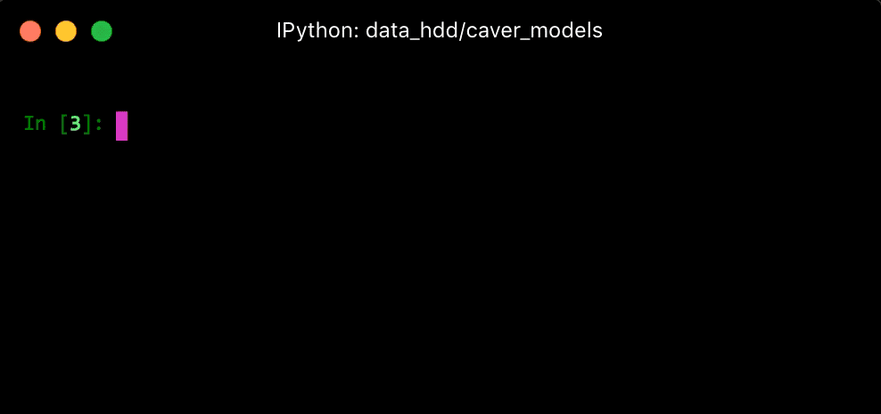

# Caver: a toolkit for multilabel text classification.

[中文版](./README_zh.md)

Rising a torch in the cave to see the words on the wall. Tag short text in 3 lines. This is the **Caver**.



```
from caver import CaverModel
model = CaverModel("./checkpoint_path", device="cpu")

sentence = ["看 英 语 学 美 剧 靠 谱 吗", "科 比 携 手 姚 明 出 任 2019 篮 球 世 界 杯 全 球 大 使"]

model.predict(sentence[0], top_k=3)
>>> ['英语学习', '英语', '美剧']

model.predict(sentence[1], top_k=10)
>>> ['篮球', 'NBA', '体育', 'NBA 球员', '运动']
```

[Documents](https://guokr.github.io/Caver)

## Requirements

* PyTorch
* tqdm
* torchtext
* numpy
* Python3

## Get it

```
$ pip install caver --user
```


## Did you guys have some pre-trained models

Yes, we have released two pre-trained models on Zhihu NLPCC2018 open dataset.

```
$ wget -O - https://github.com/guokr/Caver/releases/download/0.1/checkpoints_char_cnn.tar.gz | tar zxvf -
$ wget -O - https://github.com/guokr/Caver/releases/download/0.1/checkpoints_char_lstm.tar.gz | tar zxvf -
```

## How to train on your own dataset

```
$ python3 train.py --input_data_dir {path to your origin dataset}
                   --output_data_dir {path to store the preprocessed dataset}
                   --train_filename train.tsv
                   --valid_filename valid.tsv
                   --checkpoint_dir {path to save the checkpoints}
                   --model {fastText/CNN/LSTM}
                   --batch_size {16, you can modify this for you own}
                   --epoch {10}

```

## How to setup the models for inference
Basically just setup the model and target labels, you can check [examples](./examples).
